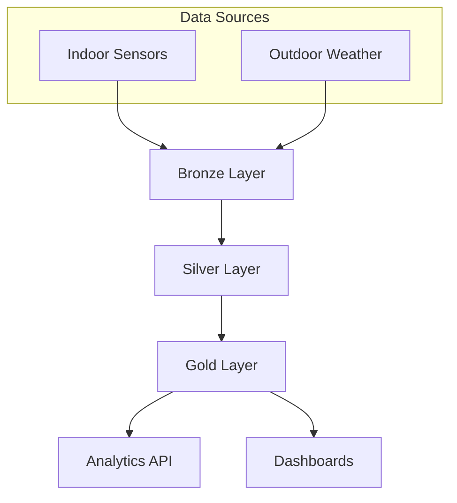

# Real-Time HVAC & Climate Data Ingestion Pipeline

An end-to-end data pipeline for processing HVAC sensor data and outdoor weather using the medallion architecture (Bronze → Silver → Gold).

## Project Overview

Built for a multi-floor office scenario, the pipeline:

- Stores indoor sensor data (temperature, humidity, CO2, VOC)
- Joins it with outdoor weather data
- Flags over-cooling and air quality issues
- Serves results through a REST API and Jupyter-based visuals

### Key Features

- Medallion architecture with Bronze → Silver → Gold layers
- Date-partitioned Parquet storage for efficient queries
- Apache Airflow DAG for scheduled runs
- FastAPI endpoints for data access
- Plotly notebook for visual checks
- Data quality checks at each stage

## Architecture



See [diagrams/architecture.mmd](diagrams/architecture.mmd) for the complete architecture diagram.

### Data Layers

1. **Bronze Layer (Raw)**: 
   - Raw data with basic type casting
   - Preserves original structure
   - Adds ingestion metadata

2. **Silver Layer (Cleaned & Enriched)**:
   - Joined indoor + outdoor data
   - Resampled to 5-minute intervals
   - Computed comfort flags (overcooled, stale air)

3. **Gold Layer (Analytics-Ready)**:
   - Daily aggregated metrics per room
   - KPIs and percentages
   - Optimized for analytics queries

## Data Models

### Indoor Sensor Events

| Column | Type | Description |
|--------|------|-------------|
| `event_id` | int | Unique event identifier |
| `ts_utc` | timestamp | ISO8601 UTC timestamp |
| `building_id` | string | Building identifier (e.g., "building_A") |
| `room_id` | string | Room identifier (e.g., "office_1") |
| `sensor_type` | string | One of: "temp", "humidity", "co2", "voc" |
| `value` | float | Sensor reading |
| `unit` | string | Unit of measurement |

### Outdoor Weather

| Column | Type | Description |
|--------|------|-------------|
| `ts_utc` | timestamp | ISO8601 UTC timestamp |
| `latitude` | float | Location latitude |
| `longitude` | float | Location longitude |
| `temp_c` | float | Temperature in Celsius |
| `rel_humidity_pct` | float | Relative humidity percentage |
| `wind_speed_ms` | float | Wind speed in m/s |
| `source` | string | Data source identifier |

### Comfort Facts (Silver Layer)

Combined indoor + outdoor data with computed flags:

- `ts_utc`, `date`, `building_id`, `room_id`
- `indoor_temp_c`, `indoor_rel_humidity_pct`, `indoor_co2_ppm`, `indoor_voc_ppb`
- `outdoor_temp_c`, `outdoor_rel_humidity_pct`
- **`overcooled_flag`**: `indoor_temp < 21°C AND outdoor_temp > 25°C`
- **`stale_air_flag`**: `indoor_co2 > 1000 ppm`

### Daily Metrics (Gold Layer)

Aggregated daily metrics per room:

- `date`, `building_id`, `room_id`
- `n_readings`, `n_overcooled`, `n_stale_air`
- `pct_time_overcooled`, `pct_time_stale_air`
- `avg_indoor_temp`, `avg_indoor_humidity`, `avg_indoor_co2`
- `avg_outdoor_temp`

## Quick Start

### Prerequisites

- Python 3.9+
- pip or conda for package management

### One-Line Setup and Test

```bash
# Install dependencies, generate sample data, and run tests
make quick-start

# Or manually:
pip install -r requirements.txt
python scripts/generate_sample_data.py
pytest tests/ -v
```

### Demo Steps (Frontend Integration)

Run the full pipeline and export data for the frontend demo:

```bash
# 1. Setup and activate virtual environment
python -m venv .venv
source .venv/bin/activate

# 2. Install dependencies
make install

# 3. Generate sample data + run tests
make quick-start

# 4. Export canonical JSON for frontend
make export-json

# 5. Validate JSON schema
make validate-json
```

**Artifact paths:**
| Output | Path | Size |
|--------|------|------|
| Raw indoor data | `data/raw/indoor/*.jsonl` | ~50 KB |
| Raw outdoor data | `data/raw/outdoor/*.jsonl` | ~5 KB |
| Bronze layer | `data/bronze/**/*.parquet` | ~10 KB |
| Silver layer | `data/silver/**/*.parquet` | ~15 KB |
| Gold layer | `data/gold/**/*.parquet` | ~5 KB |
| **Frontend JSON** | `artifacts/json/hvac_climate_telemetry.json` | ~2 KB |

Sync to frontend demo:
```bash
cd ../energy-pipeline-demo && ./sync-data.sh
```

### Installation

```bash
# Clone the repository
git clone https://github.com/shahabsalehi/HVAC-Climate-Data-Pipeline.git
cd HVAC-Climate-Data-Pipeline

# Create virtual environment (recommended)
python -m venv .venv
source .venv/bin/activate    # Linux/macOS
# .venv\Scripts\activate     # Windows

# Install dependencies
pip install -r requirements.txt
```

### Generate Sample Data

Generate sample data with a single command:

```bash
# Generate 2 days of sample data (default)
python scripts/generate_sample_data.py

# Or use make
make sample-data

# Generate 7 days of data
python scripts/generate_sample_data.py --days 7

# Generate data for a specific date
python scripts/generate_sample_data.py --start-date 2025-01-15 --days 2
```

This creates JSONL files in `data/raw/indoor/` and `data/raw/outdoor/` with:
- Indoor sensor data: 5-minute intervals, 4 rooms, 4 sensor types each (temp, humidity, CO2, VOC)
- Outdoor weather data: hourly intervals with temperature, humidity, and wind speed

### Run the Pipeline

```bash
# Process data for a specific date
python scripts/ingest_transform.py --date 2025-01-15
```

This will:
1. Load raw JSONL files
2. Transform to Bronze (type casting, cleaning)
3. Transform to Silver (join, compute flags)
4. Transform to Gold (daily aggregations)
5. Write partitioned Parquet files

### Start the API Server

```bash
# Using uvicorn directly
uvicorn api.main:app --reload --host 0.0.0.0 --port 8000

# Or using the Python script
python api/main.py
```

Access the API:
- Interactive docs: http://localhost:8000/docs
- Health check: http://localhost:8000/health

### Explore the Data

Open the Jupyter notebook:

```bash
jupyter notebook notebooks/exploration.ipynb
```

The notebook includes:
- Indoor vs outdoor temperature visualizations
- Overcooling detection and highlighting
- Air quality (CO2) analysis
- Per-room comfort metrics dashboard

## API Endpoints

### GET /comfort/summary

Get daily comfort summary for all rooms (or a specific room).

```bash
curl "http://localhost:8000/comfort/summary?date=2025-01-15"
```

### GET /comfort/overcooling

Get overcooling metrics time-series.

```bash
curl "http://localhost:8000/comfort/overcooling?start_date=2025-01-15&end_date=2025-01-16&room_id=office_1"
```

### GET /comfort/stale-air

Get stale air (high CO2) metrics time-series.

```bash
curl "http://localhost:8000/comfort/stale-air?start_date=2025-01-15&end_date=2025-01-16"
```

### GET /rooms

List all available rooms.

```bash
curl "http://localhost:8000/rooms"
```

## Workflow Orchestration

The pipeline supports two workflow orchestration frameworks:

### Apache Airflow (Production)

The production-ready DAG is located at `airflow_dags/hvac_pipeline_dag.py`.

**Workflow Steps:**
1. `generate_sample_data` - Generate synthetic data (optional, for testing)
2. `run_data_pipeline` - Execute Bronze → Silver → Gold transformations
3. `validate_data_quality` - Run quality checks on Gold layer

**Schedule**: Daily at midnight (`@daily`)

To run with Airflow:

```bash
# Initialize Airflow database
airflow db init

# Copy DAG to Airflow DAGs folder
cp airflow_dags/hvac_pipeline_dag.py ~/airflow/dags/

# Start Airflow webserver
airflow webserver --port 8080

# Start Airflow scheduler (in another terminal)
airflow scheduler
```

Access Airflow UI at http://localhost:8080

### Prefect (Alternative)

A fully functional Prefect flow is available at `airflow_dags/prefect_pipeline_flow.py` as an alternative to Airflow.

**Features:**
- Same functionality as Airflow DAG
- Can run locally or with Prefect Cloud/Server
- Includes data generation, ETL pipeline, and quality checks

To run with Prefect:

```bash
# Install Prefect (optional dependency)
pip install prefect

# Run the flow locally
python airflow_dags/prefect_pipeline_flow.py

# Or import and run programmatically
from airflow_dags.prefect_pipeline_flow import hvac_climate_pipeline
result = hvac_climate_pipeline(execution_date='2025-01-15', include_data_generation=True)
```

## Repository Structure

```
HVAC-Climate-Data-Pipeline/
├── airflow_dags/              # Airflow DAG definitions
│   ├── hvac_pipeline_dag.py   # Main pipeline DAG
│   └── prefect_pipeline_flow.py  # Prefect alternative
├── api/                       # FastAPI REST API
│   ├── __init__.py
│   └── main.py               # API endpoints
├── scripts/                  # Data processing scripts
│   ├── generate_indoor_data.py   # Indoor sensor data generator
│   ├── generate_outdoor_data.py  # Outdoor weather generator
│   └── ingest_transform.py       # Pipeline transformation logic
├── notebooks/                # Jupyter notebooks
│   └── exploration.ipynb     # Data visualization & analysis
├── diagrams/                 # Architecture diagrams
│   └── architecture.mmd      # Mermaid architecture diagram
├── data/                     # Data lake (partitioned)
│   ├── raw/                  # Raw JSONL files
│   ├── bronze/               # Bronze Parquet (typed & cleaned)
│   ├── silver/               # Silver Parquet (joined & enriched)
│   └── gold/                 # Gold Parquet (aggregated metrics)
├── tests/                    # Test suite
│   └── test_pipeline.py
├── requirements.txt          # Python dependencies
├── .gitignore
└── README.md
```

## Testing

The repository includes a single integration-oriented test module covering data generation, pipeline transforms, and basic API responses. Run it locally after generating sample data.

### Run Tests

```bash
# Run tests with pytest
pytest tests/ -v

# Or use make
make test
```

## Frontend Export

Export gold-layer climate data to JSON for integration with the `energy-pipeline-demo` frontend:

### Environment Setup

```bash
# Create and activate virtual environment (recommended)
python -m venv .venv
source .venv/bin/activate    # Linux/macOS
# .venv\Scripts\activate     # Windows

# Install dependencies
pip install -r requirements.txt
```

### Export Command

```bash
# Export climate data to JSON
make export-json

# Output: artifacts/json/hvac_climate_telemetry.json (canonical)
```

### Canonical Schema (Recommended)

The **canonical** export `hvac_climate_telemetry.json` provides a rich, production-ready schema:

```json
{
  "pipeline": "hvac_climate_data",
  "generated_at": "2025-11-28T12:00:00Z",
  "site": {
    "name": "Building A - Main Campus",
    "location": "Tallinn, Estonia",
    "building_type": "Commercial Office",
    "floor_area_m2": 3450
  },
  "current_conditions": {
    "indoor_temp_c": 21.5,
    "outdoor_temp_c": 8.2,
    "indoor_humidity_percent": 42,
    "outdoor_humidity_percent": 78,
    "co2_ppm": 580,
    "aqi_index": 32,
    "hvac_status": "Heating Mode"
  },
  "trends_24h": { ... },
  "hourly_data": [ { "hour": 0, "indoor_temp_c": 20.8, ... } ],
  "alerts_summary": { "active_alerts": 1, "resolved_today": 2, ... }
}
```

| Section | Fields | Description |
|---------|--------|-------------|
| `pipeline` | string | Pipeline identifier |
| `generated_at` | ISO 8601 UTC | Export timestamp |
| `site` | object | Building metadata |
| `current_conditions` | object | Latest sensor readings |
| `trends_24h` | object | 24-hour statistics |
| `hourly_data` | array | Hourly time series |
| `alerts_summary` | object | Alert counts and latest alert |

### Sync to Frontend

After export, copy to the frontend demo:

```bash
# From workspace root
cp HVAC-Climate-Data-Pipeline/artifacts/json/hvac_climate_telemetry.json \
   energy-pipeline-demo/public/data/

# Or use the sync script
cd energy-pipeline-demo && ./sync-data.sh
```

## Productionization Path

This pipeline is designed for easy transition to production databases:

### Database Integration

The canonical JSON schema maps directly to relational tables:

| JSON Section | Database Table | Notes |
|--------------|----------------|-------|
| `site` | `dim_sites` | Dimension table for building metadata |
| `current_conditions` | `fact_sensor_readings` | Real-time sensor data |
| `hourly_data` | `fact_hourly_climate` | Time-series fact table |
| `alerts_summary` | `fact_alerts` | Alert tracking |

### PostgreSQL Example

```sql
-- Create tables matching the schema
CREATE TABLE dim_sites (
    site_id SERIAL PRIMARY KEY,
    name VARCHAR(255),
    location VARCHAR(255),
    building_type VARCHAR(100),
    floor_area_m2 NUMERIC
);

CREATE TABLE fact_hourly_climate (
    id SERIAL PRIMARY KEY,
    site_id INT REFERENCES dim_sites(site_id),
    hour INT,
    indoor_temp_c NUMERIC,
    outdoor_temp_c NUMERIC,
    co2_ppm INT,
    recorded_at TIMESTAMPTZ DEFAULT NOW()
);
```

### Migration Strategy

1. **Development**: Use JSON exports + `make export-json`
2. **Staging**: Add database loader (`scripts/load_to_db.py`) writing same schema
3. **Production**: Replace JSON export with direct database writes in Airflow DAG

The schema remains consistent across all stages, enabling seamless transition.

## Available Commands

The project includes a Makefile with convenient commands for common operations:

```bash
# Show all available commands
make help

# Installation and setup
make install          # Install production dependencies
make install-dev      # Install development dependencies
make setup           # Run setup script to create venv and install deps
make quick-start     # One-command setup: install, generate data, run tests

# Data generation
make sample-data     # Generate sample HVAC and climate data
make generate-data   # Same as sample-data

# Running the application
make run-api         # Start the FastAPI development server
make run-api-prod    # Start the API in production mode (4 workers)
make jupyter         # Start Jupyter Lab

# Code quality
make lint            # Run linters (flake8, mypy)
make format          # Format code with black and isort
make format-check    # Check formatting without changes
make test            # Run tests with pytest
make test-cov        # Run tests with coverage report

# Cleanup
make clean           # Remove generated files and cache
```

## Technology Stack

- **Language**: Python 3.9+
- **Data Processing**: pandas, pyarrow
- **Storage**: Parquet files (partitioned by date)
- **Orchestration**: Apache Airflow
- **API**: FastAPI + uvicorn
- **Visualization**: Plotly, Jupyter
- **Testing**: pytest

## Data Quality Checks

The pipeline includes automated quality checks:

1. **Completeness**: Ensure all expected rooms have data
2. **Volume**: Verify minimum reading counts per room
3. **Range Validation**: Check temperature and sensor values are within reasonable bounds
4. **Freshness**: Validate data timestamps

## Example Queries

### Using the API

```bash
# Get summary for a specific date
curl "http://localhost:8000/comfort/summary?date=2025-01-15" | jq

# Get overcooling metrics for a date range
curl "http://localhost:8000/comfort/overcooling?start_date=2025-01-15&end_date=2025-01-16" | jq

# Filter by specific room
curl "http://localhost:8000/comfort/summary?date=2025-01-15&room_id=office_1" | jq
```

### Using Python

```python
import pandas as pd

# Load gold metrics
df = pd.read_parquet('data/gold/daily_comfort_metrics/year=2025/month=01/day=15/')

# Show rooms with overcooling issues
overcooled = df[df['pct_time_overcooled'] > 5.0]
print(overcooled[['room_id', 'pct_time_overcooled']])

# Show rooms with air quality issues
stale_air = df[df['pct_time_stale_air'] > 10.0]
print(stale_air[['room_id', 'avg_indoor_co2', 'pct_time_stale_air']])
```

## Contributing

Contributions are welcome. See [CONTRIBUTING.md](CONTRIBUTING.md) for guidelines.

## License

MIT License - see [LICENSE](LICENSE) for details.

## 📞 Support

For questions or issues, please open an issue on GitHub.
